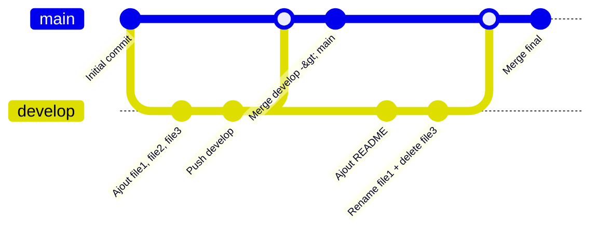

# CESI2
##1. Création d'une branche "develop"
--
Créer une seconde branche develop
--

##2. Création de dossier et fichiers
--
Création d'un dossier DevOps avec 3 fichiers txt dedans
--

##3. Modification des noms des fichiers
--
Modification du file1 en file1.txt
--

##X. Sources
--
https://codeur-pro.fr/github-et-acces-par-tokens/
https://docs.github.com/fr/authentication/connecting-to-github-with-ssh/generating-a-new-ssh-key-and-adding-it-to-the-ssh-agent
--

## Tableau de commandes

| Commandes  | Descriptions |
| ------------- | ------------- |
| Git push  | Pousser les modifs dans le repo  |
| Git Commit  | Afficher un message motif  |

